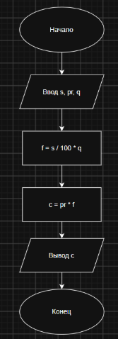

## Условие задачи
Написать и отладить программу стоимости поездки, исходя из известного расстояния и стоимости бензина

## 1. Алгоритм и блок-схема

### Алгоритм
1. **Начало**
2. Объявляем переменные:
  s - расстояние, pr - цена за бензин, q - расход бензина на 100 км
3. считаем сколько понадобится бензина на поездку
   f = s / 100 * q
4. считаем стоимость поездки
   c = pr * f
5. Вывод результата.
9. **Конец**

### Блок-схема
 

## 2. Реализация программы

## 3. Результаты работы программы
491,94

## 4. Информация о разработчике

Демчило Иван БОТИ-262
